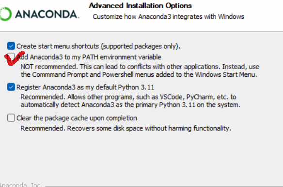
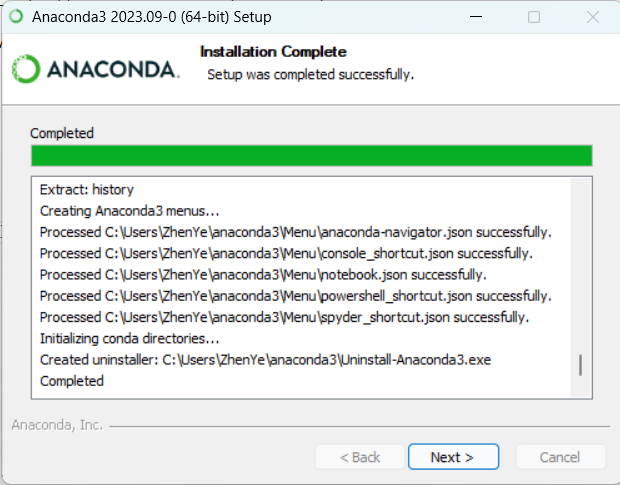
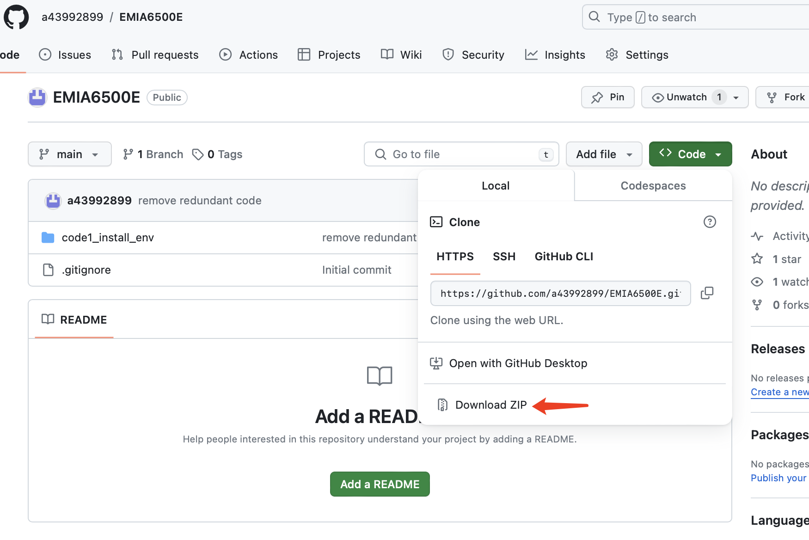
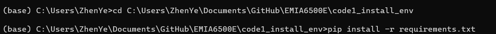
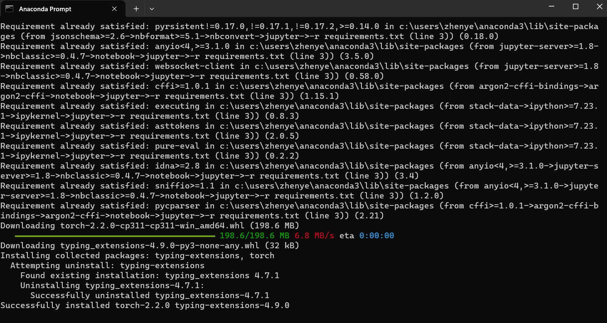
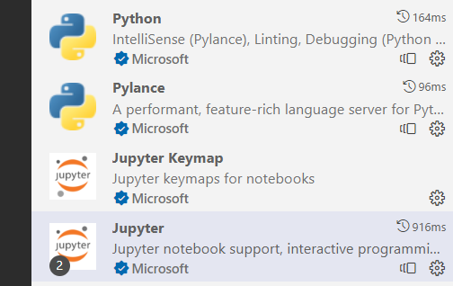
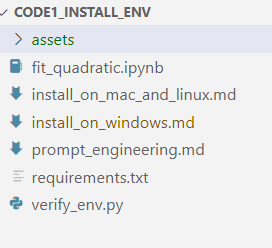
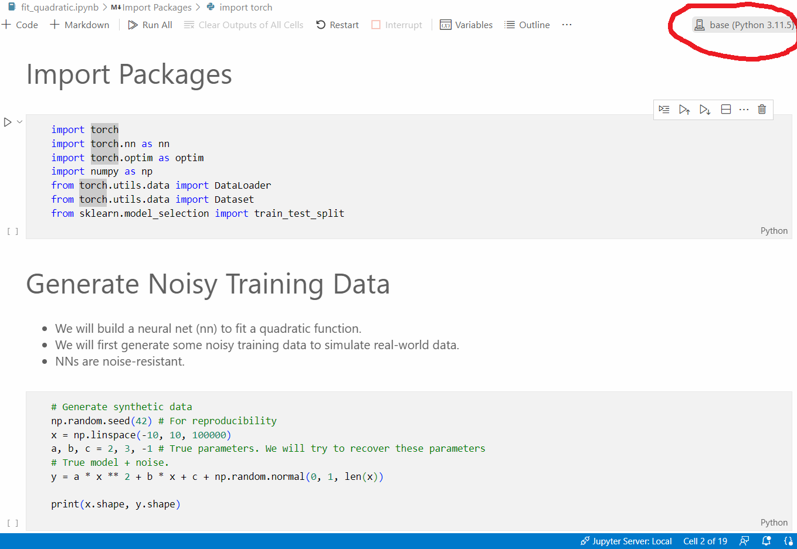
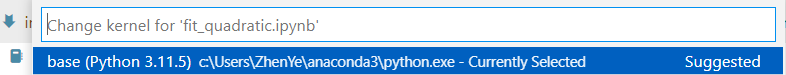
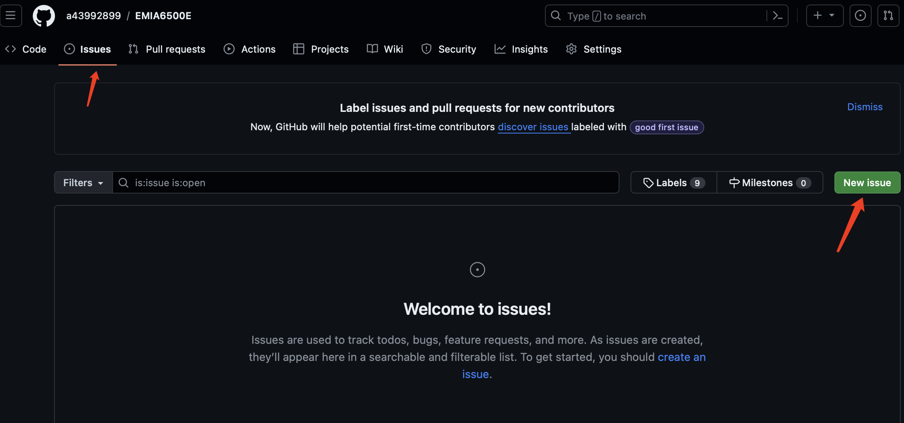

# Install vscode on windows
TAs are using Visual Studio Code to write and run Python code.
You can install Visual Studio Code on Windows by following the instructions on the [Visual Studio Code website](https://code.visualstudio.com/docs/setup/windows).

# Install Miniconda or Anaconda on Windows

## Download
[Download Link](https://www.anaconda.com/download)

You will get an Anaconda3***Windows-x86_64.exe file.

## Install

Then install it.

choose the second option.



If you install successfully , you will see 



# Download EMIA6500E Course Materials

You should first download the course materials from the [course github](https://github.com/a43992899/EMIA6500E/tree/main).

If you know how to use git, you can clone the repository by running the following command:
```bash
git clone https://github.com/a43992899/EMIA6500E.git
```

If you don't know how to use git, you can download the repository as a zip file by clicking the green "Code" button.


If you want to install git, here is the [download link](https://github.com/git-for-windows/git/releases/download/v2.43.0.windows.1/Git-2.43.0-64-bit.exe). Then you can install it.

# Install EMIA6500E Environment

Open anaconda prompt, 


Run

```bash
cd path/to/code1_install_env 
```
```bash
pip install -r requirements.txt
```



Finally, you will see



# Run the Pytorch Example

Open Vscode, then open your local folder path/to/code1_install_env 


You should follow this to install `python` and `jupyter` extensions on vscode. See [Install Python and Jupyter extensions](https://www.alphr.com/vs-code-open-jupyter-notebook/)

You will see 



Then click fit_quadratic.ipynb



Select kernel



The kernel is the anaconda path



Now you can open the example jupyter notebook by clicking the `code1_install_env/fit_quadratic.ipynb` file in vscode.

It is a minimal pytorch example applying stochastic gradient descent (SGD) to learn a quadratic function from some noisy data.

You can run the notebook by clicking the `Run Cell` button or pressing `Shift+Enter` on your keyboard.

You should get familiar with the notebook interface and the basic operations such as running a cell, adding a new cell, and deleting a cell.

You should also get familiar with the pytorch library and the basic operations such as creating a tensor, defining a model, and training a model.

If you have any questions, please try to ask ChatGPT first. If it does not fix your problem, you may open an issue on the course github repository, or ask the TAs during the office hours.

To open an issue on the course github repository, you can click the `Issues` tab and then click the `New issue` button. A quick link is [here](https://github.com/a43992899/EMIA6500E/issues).



