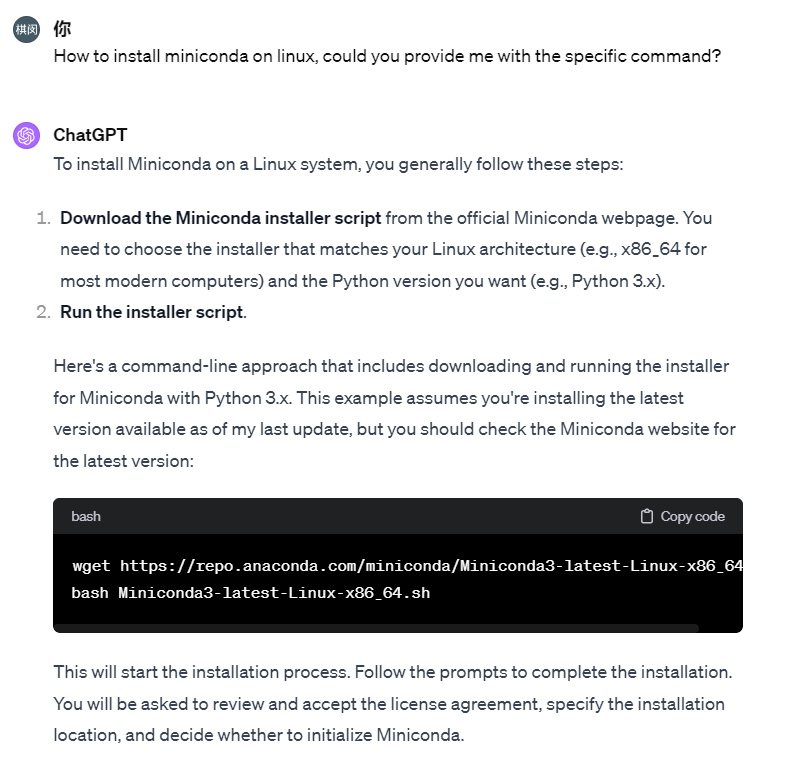

# The simplest way to ask ChatGPT for an answer

It's fine to ask TA questions if you encounter some pragmatic questions, but since our TAs are also being busy doing their own stuff, the best practice is to first
ask ChatGPT. And if you find that the ChatGPT do not help then you can reach out to TA for further assistance.

In this Chapter, we are showing a minimal example on how to use ChatGPT.

First of all, you can use official [OPENAI website](https://chat.openai.com/) (it might need VPN to access) or [HKUST website](https://chatgpt.ust.hk/), 
we will show how to ask effectively. 

For instance, if you're facing an installation issue, simply enter your query into the provided input field, and ChatGPT is expected to deliver an appropriate response, as illustrated below.   

As depicted, ChatGPT is highly adept for everyday inquiries, and basic prompting techniques should suffice for most situations.

Nonetheless, for more sophisticated requirements such as:

1. [Chain-of-Thought prompting](https://www.promptingguide.ai/techniques/cot), 
2. [Formatting code correctly when addressing coding problems](https://github.com/RimaBuilds/Master-coding-prompts-with-ChatGPT?tab=readme-ov-file#32-ensuring-generated-code-is-in-code-block-format) ,
3. [GPTs](https://suefel.com/gpts)

We strongly suggest you refer to the respective documentation for guidance.

We hope you enjoy and make the most out of your experience with ChatGPT!